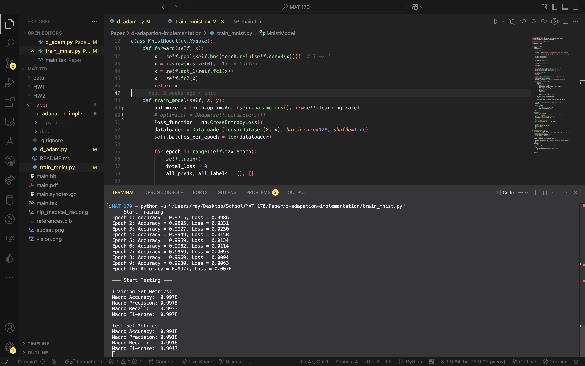

# D-Adaptation Implementation

This repository contains an implementation for D-Adaptation and also
as well as a standard implementation of a CNN model for solving MNIST,
which utilizes D-Adaptation.

The two relevant files are:

-   `d_adam`: Implementation of the Adam variant of D-Adaptation
-   `train_mnist`: CNN Model for MNIST

The code closely follows the official implementation.

## Results

Output for standard Adam

```
Epoch 1: Accuracy = 0.9715, Loss = 0.0986
Epoch 2: Accuracy = 0.9895, Loss = 0.0331
Epoch 3: Accuracy = 0.9927, Loss = 0.0230
Epoch 4: Accuracy = 0.9949, Loss = 0.0158
Epoch 5: Accuracy = 0.9959, Loss = 0.0134
Epoch 6: Accuracy = 0.9962, Loss = 0.0114
Epoch 7: Accuracy = 0.9969, Loss = 0.0093
Epoch 8: Accuracy = 0.9969, Loss = 0.0094
Epoch 9: Accuracy = 0.9980, Loss = 0.0063
Epoch 10: Accuracy = 0.9977, Loss = 0.0070

--- Start Testing ---

Training Set Metrics:
Macro Accuracy:  0.9978
Macro Precision: 0.9978
Macro Recall:    0.9977
Macro F1-score:  0.9978

Test Set Metrics:
Macro Accuracy:  0.9918
Macro Precision: 0.9918
Macro Recall:    0.9916
Macro F1-score:  0.9917
```

Screenshot



Graph


Output for D-Adapted Adam

```
--- Start Training ---
Epoch 1: Accuracy = 0.9619, Loss = 0.1181
Epoch 2: Accuracy = 0.9915, Loss = 0.0274
Epoch 3: Accuracy = 0.9948, Loss = 0.0163
Epoch 4: Accuracy = 0.9954, Loss = 0.0136
Epoch 5: Accuracy = 0.9968, Loss = 0.0098
Epoch 6: Accuracy = 0.9969, Loss = 0.0102
Epoch 7: Accuracy = 0.9976, Loss = 0.0078
Epoch 8: Accuracy = 0.9974, Loss = 0.0078
Epoch 9: Accuracy = 0.9976, Loss = 0.0074
Epoch 10: Accuracy = 0.9986, Loss = 0.0046

--- Start Testing ---

Training Set Metrics:
Macro Accuracy:  0.9980
Macro Precision: 0.9980
Macro Recall:    0.9980
Macro F1-score:  0.9980

Test Set Metrics:
Macro Accuracy:  0.9926
Macro Precision: 0.9926
Macro Recall:    0.9926
Macro F1-score:  0.9926
```

Screenshot


Graph


